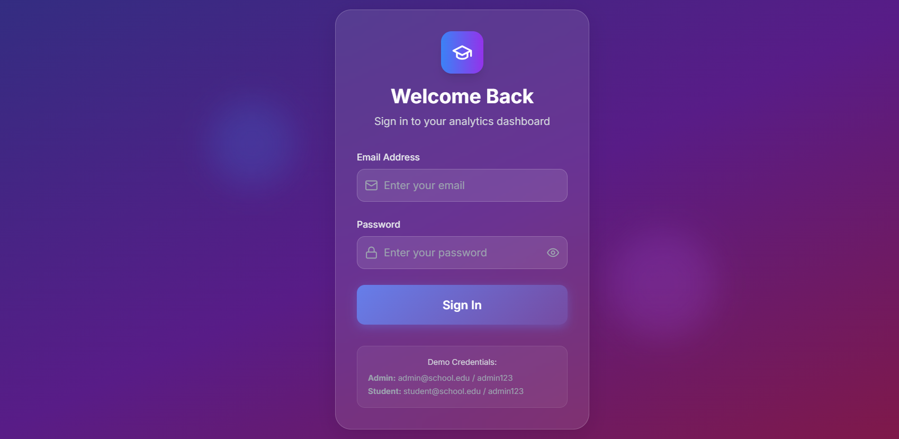
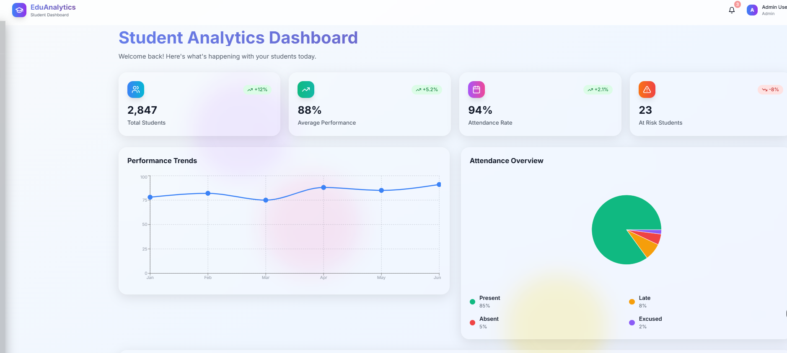

# 🎓 Student Analytics Dashboard - Complete MERN Stack

A professional Student Analytics Dashboard built with the MERN stack, featuring Netflix-level UI and consulting-grade functionality.

## 🚀 Quick Start

### 1. Install Dependencies
```bash
npm run install-all
```

### 2. Backend Setup
```bash
cd backend
cp .env.example .env
# Add your MongoDB URI to .env
npm run dev
```

### 3. Frontend Setup (New Terminal)
```bash
cd frontend  
npm run dev
```

### 4. Access Application
- Frontend: http://localhost:3000
- Backend API: http://localhost:5000
- Health Check: http://localhost:5000/api/health

## 🔑 Demo Login
- Email: admin@school.edu
- Password: admin123

## 🎯 Features
✅ Netflix-level UI with animations
✅ JWT Authentication  
✅ Interactive Charts
✅ Student Management
✅ Performance Analytics
✅ Professional Dashboard
✅ Cloud Deployment Ready

## 📸 Screenshots

### Login Page  


### Dashboard  



---

## 📞 Contact

- **Email:** subhavpathak18@gmail.com  
- **LinkedIn:** [Subhav Kumar](https://www.linkedin.com/in/subhav-kumar-706401200/)   

---

> Made by **Subhav Kumar**


